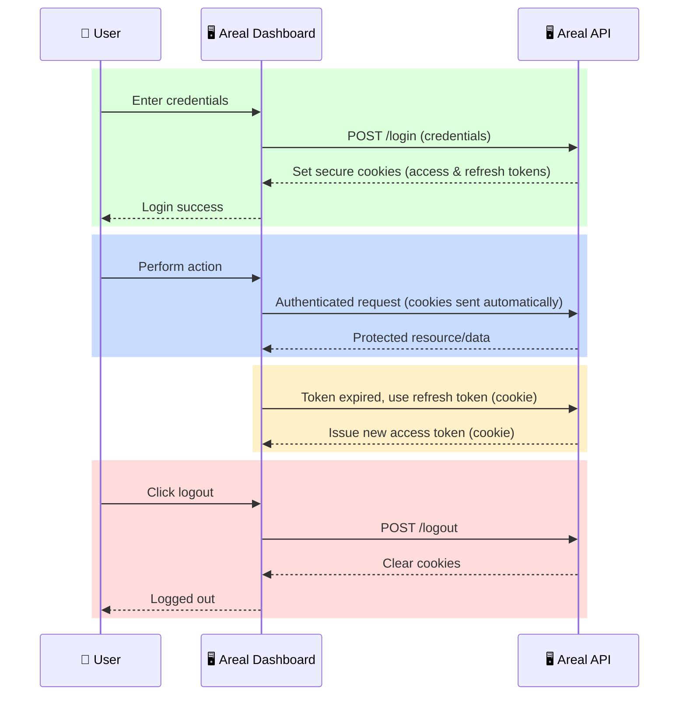

# Authentication

Areal API support multiple authentication mechanisms:

- **JWT over cookies**   (recommended)
- **JWT over Bearer**
- **ApiKey over headers** (on-demand)
- **MFA over Authenticator App** (Google Authenticator, PingID, Authy, etc.)

## Authentication Flow

Below is a high-level sequence diagram illustrating the main phases of the authentication lifecycle:



## Example Usage

```py title="Login" linenums="1"
import requests

BASE_URL = 'http://dev-api.v2.areal.ai/api/v2'

# 0. Login - details in Authentication section
login_response = requests.post(f'{BASE_URL}/accounts/login/', {
    'username': 'test@areal.ai',
    'password': 'test123',
})
client = requests.Session()
client.cookies.update(
    {
        'access_token': login_response.cookies['access_token'],
        'refresh_token': login_response.cookies['refresh_token'],
    }
)
# this client is now authenticated for the duration of access_token
# after that you can refresh it using the /accounts/refresh endpoint
```


## Security Highlights

- **Secure Login:** Credentials are never stored or transmitted in plain text.
- **Token-Based Authentication:** Access and refresh tokens are used to manage sessions securely.
- **Cookie Usage:** Secure, HTTP-only cookies are used to store tokens, protecting them from XSS attacks.
- **Session Refresh:** Seamless token refresh ensures uninterrupted user experience.
- **Logout:** Users can securely terminate their sessions at any time.
- **Best-Practice Security:** All authentication flows use encryption, secure cookie flags, and protection against common web vulnerabilities.

---

For technical integration details see [Accounts](https://dev-api.v2.areal.ai/api/v2/docs#tag/accounts).