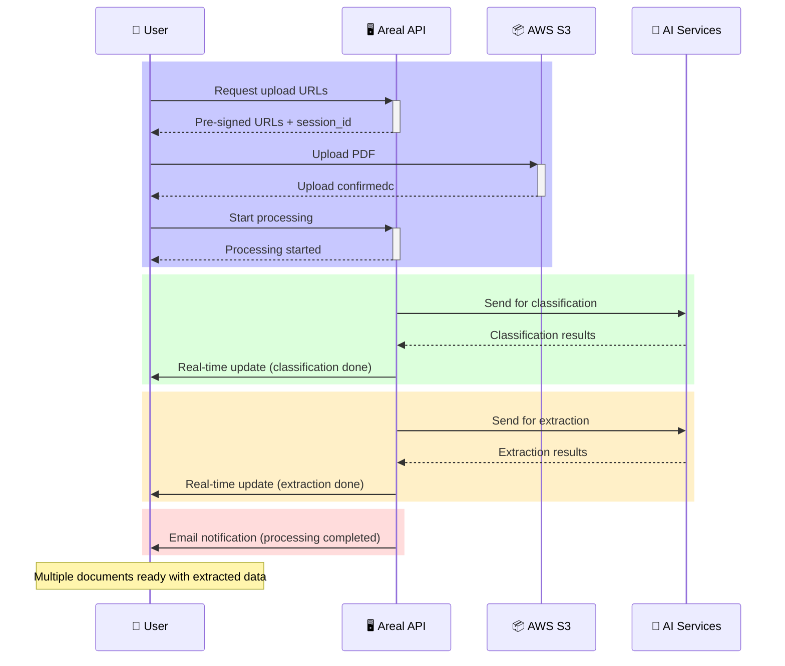

# Areal API Documentation

🙋‍♂️ Welcome to the Areal API documentation! This API provides a comprehensive set of endpoints for managing various aspects of the Areal system.

🚂 Areal helps you manage and streamline every aspect of your mortgage closing process.

## Document Processing Flow

The document processing functionality is the core of the Areal system, enabling users to upload PDF documents and automatically extract structured data through AI-powered classification and extraction services.

### High-Level Overview

The document processing flow transforms a single uploaded PDF into multiple classified documents with extracted structured data. This process involves several microservices working together to analyze, classify, and extract information from mortgage documents.

### Sequence Diagram

See the [Core Process](core/index.md) for more details.