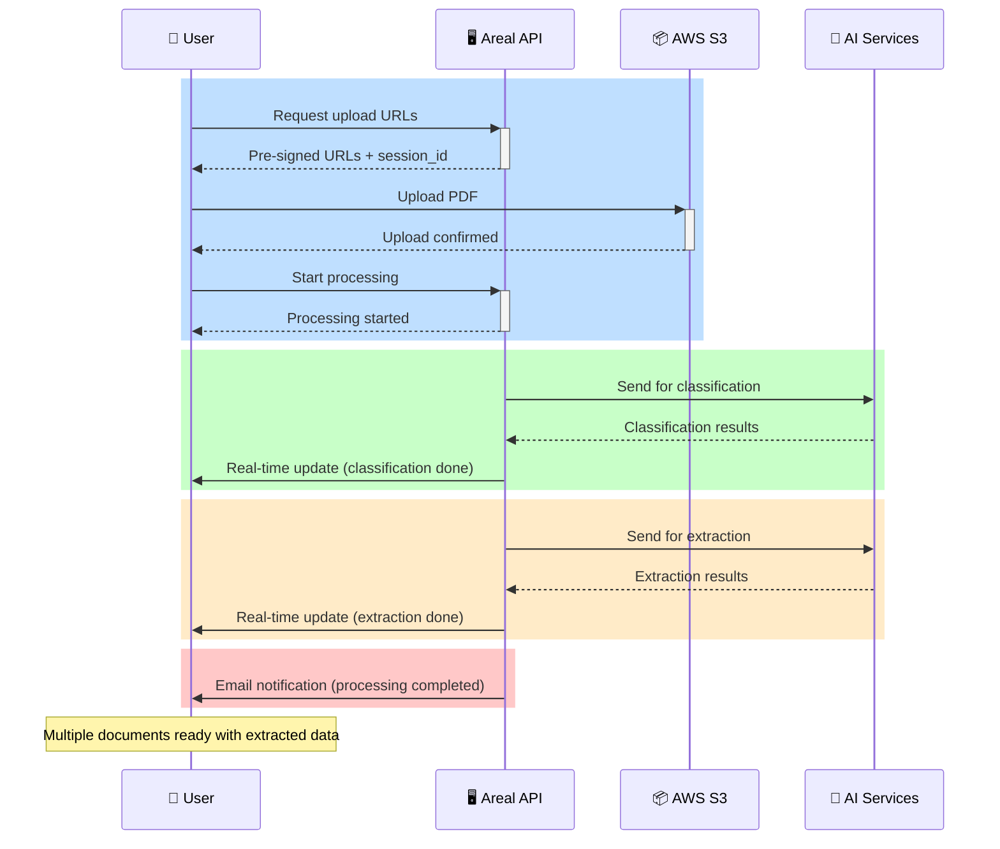

# Document Processing Flow

The document processing functionality is the core of the Areal system, enabling users to upload PDF documents and automatically extract structured data through AI-powered classification and extraction services.

## High-Level Overview

The document processing flow transforms a single uploaded PDF into multiple classified documents with extracted structured data. This process involves several microservices working together to analyze, classify, and extract information from mortgage documents.

### Sequence Diagram



#### Phase 1: Upload Preparation and Initiation
1. User requests pre-signed URLs to upload documents. See [Upload Preparation](https://dev-api.v2.areal.ai/api/v2/docs#/processing/api_views_processing_get_presigned_url)
2. User uploads PDF(s) directly to S3 using the provided URLs. 
3. User tells the system to start processing the uploaded document(s). See [Start Processing](https://dev-api.v2.areal.ai/api/v2/docs#/processing/api_views_processing_start_processing)

#### Phase 2: Classification
- The system analyzes the uploaded PDF(s) and classifies the document types.
- User receives a real-time notification from the API when classification is complete.
- See [Classification](classification.md) section for details.

#### Phase 3: Extraction
- The system extracts structured data from the classified documents.
- User receives a real-time notification from the API when extraction is complete.
- See [Extraction](extraction.md) section for details.

#### Phase 4: Finalization
- User receives an email notification from the API when processing is complete and documents are ready for review.

!!! warning "Asynchronous Processing"
    The entire flow is asynchronous with callback-based communication. So if you are planning to integrate your software with Areal, you need to be prepared to handle the callback.

## Example Usage

```py title="Processing Flow" linenums="1"
import requests
from pathlib import Path

BASE_PATH = Path(__file__).parent
BASE_URL = 'http://dev-api.v2.areal.ai/api/v2'

# 0. Login - details in Authentication section
login_response = requests.post(f'{BASE_URL}/accounts/login/')
client = requests.Session()
client.cookies.update( # (1)
    {
        'access_token': login_response.cookies['access_token'],
        'refresh_token': login_response.cookies['refresh_token'],
    }
)
# this client is now authenticated for the duration of access_token
# after that you can refresh it using the /accounts/refresh endpoint

# 1. Get Pre-Signed URL's for a secure & fast upload channel
file_names = ['sample.pdf']
presigned_url_response = client.post(
    f'{BASE_URL}/processing/presigned_url/',
    # params={'upload_session_id': upload_session_id}, -> for uploading to a specific session
    json={'file_names': file_names},
).json()

# 2. Upload to your PDF's to the PreSignedURL's
for file_name, presigned_url in zip(
    file_names, presigned_url_response['presigned_urls']
):
    upload_response = requests.post(
        presigned_url['url'],
        data=presigned_url['fields'],
        files={'file': (BASE_PATH / file_name).read_bytes()},
    )

    # 3. Start processing flow
    process_response = client.post(
        f'{BASE_URL}/processing/upload/',
        json={
            'upload_session_id': presigned_url_response['upload_session_id'],
            'document_id': presigned_url['document_id'],
            'file_name': file_name,
        },
    )

```
