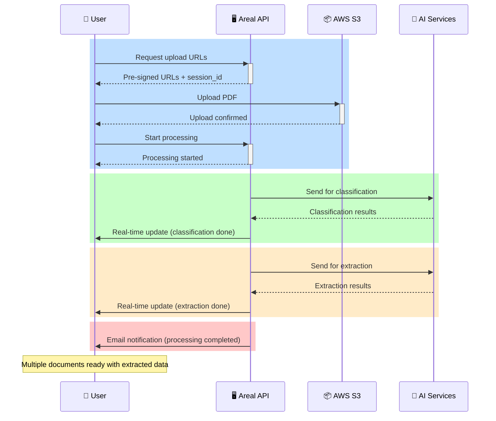

# Document Processing

The document processing functionality is the core of the Areal system. 
With our powerful AI models, we enable users to upload large mortgage loans in PDF format and get classified documents with structured extracted data.

### Sequence Diagram



!!! warning "Asynchronous Processing"
    The entire flow is asynchronous, meaning that when you start the processing we will respond with a __request_id__ which you can use to track of the status of the processing. 
    
    While users of Areal Dashboard can easily see the live status of their documents.
    
    So if you are planning to integrate our API, you can use our WebSocket API or manually poll the status of the processing.
    
    See [Status Tracking](status.md) for more details.

## Example Usage

```py title="Start Processing" linenums="1"
import requests
from pathlib import Path

BASE_PATH = Path(__file__).parent
BASE_URL = 'http://dev-api.v2.areal.ai/api/v2'

# 0. Login - details in Authentication section
...

# 1. Get Pre-Signed URL's for a secure & fast upload channel
file_names = ['sample.pdf']
presigned_url_response = client.post(
    f'{BASE_URL}/processing/presigned_url/',
    # params={'upload_session_id': upload_session_id}, -> for uploading to a specific session
    json={'file_names': file_names},
).json()

# 2. Upload to your PDF's to the PreSignedURL's
for file_name, presigned_url in zip(
    file_names, presigned_url_response['presigned_urls']
):
    upload_response = requests.post(
        presigned_url['url'],
        data=presigned_url['fields'],
        files={'file': (BASE_PATH / file_name).read_bytes()},
    )

    # 3. Start processing flow
    process_response = client.post(
        f'{BASE_URL}/processing/upload/',
        json={
            'upload_session_id': presigned_url_response['upload_session_id'],
            'document_id': presigned_url['document_id'],
            'file_name': file_name,
        },
    )

```
