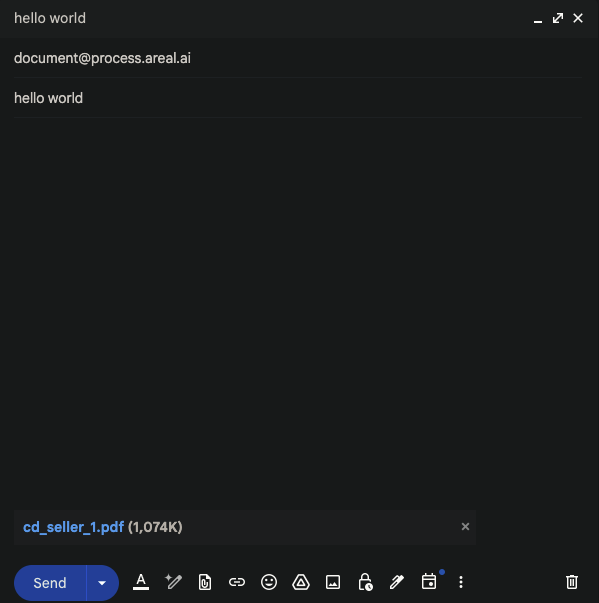

# Email Notifications & Processing

We support both event-based email notifications and document upload over email.

## Email Notifications

We support email notifications for document processing.

You can configure email notifications for the following events:

- Document Processing
- CDBalancer
- Copilot Tasks (coming soon)

### Example Usage

```py title="Configure Email Notifications" linenums="1"

# TODO: add this

```

## Email Processing

We support processing over email. You can send a PDF to our designated email address via attachments and we will process it as if you uploaded it via the API.

!!! info "Your users email must match the sender"
    For us to securely process your documents, we need to verify that the email is sent from your users. So please make sure that your Areal user's email matches the sender of the email.



!!! warning "Attachments is all you need"
    We only care about the attachments in the email. Body will be ignored.
    Your email body will be ignored.

### Example Usage

```py title="Processing over email" linenums="1"
import smtplib
import ssl
from email import encoders
from email.mime.base import MIMEBase
from email.mime.multipart import MIMEMultipart
from email.mime.text import MIMEText
from pathlib import Path
from typing import List, Optional

def send_email(
    receiver_email: str,
    subject: str,
    body: str,
    attachment_paths: Optional[List[str]] = None,
    sender_email: str = "your_email@example.com",
    smtp_server: str = "smtp.gmail.com",
    smtp_port: int = 587,
    password: str = "your_app_password",
) -> bool:
    try:
        # Create the email message
        message = MIMEMultipart()
        message["From"] = sender_email
        message["To"] = receiver_email
        message["Subject"] = subject

        # Add body to email
        message.attach(MIMEText(body, "plain"))

        # Process attachments if any
        if attachment_paths:
            for attachment_path in attachment_paths:
                try:
                    with open(attachment_path, "rb") as attachment:
                        # Create the attachment part
                        part = MIMEBase("application", "octet-stream")
                        part.set_payload(attachment.read())

                    # Encode the attachment
                    encoders.encode_base64(part)

                    # Add header to attachment
                    filename = Path(attachment_path).name
                    part.add_header(
                        "Content-Disposition", f"attachment; filename= {filename}"
                    )

                    # Add attachment to message
                    message.attach(part)
                except Exception as e:
                    print(f"Error processing attachment {attachment_path}: {str(e)}")
                    continue

        # Create secure SSL/TLS context
        context = ssl.create_default_context()

        # Connect to the SMTP server and send email
        with smtplib.SMTP(smtp_server, smtp_port) as server:
            server.starttls(context=context)
            server.login(sender_email, password)
            server.send_message(message)

        return True

    except Exception as e:
        print(f"Error sending email: {str(e)}")
        return False
```