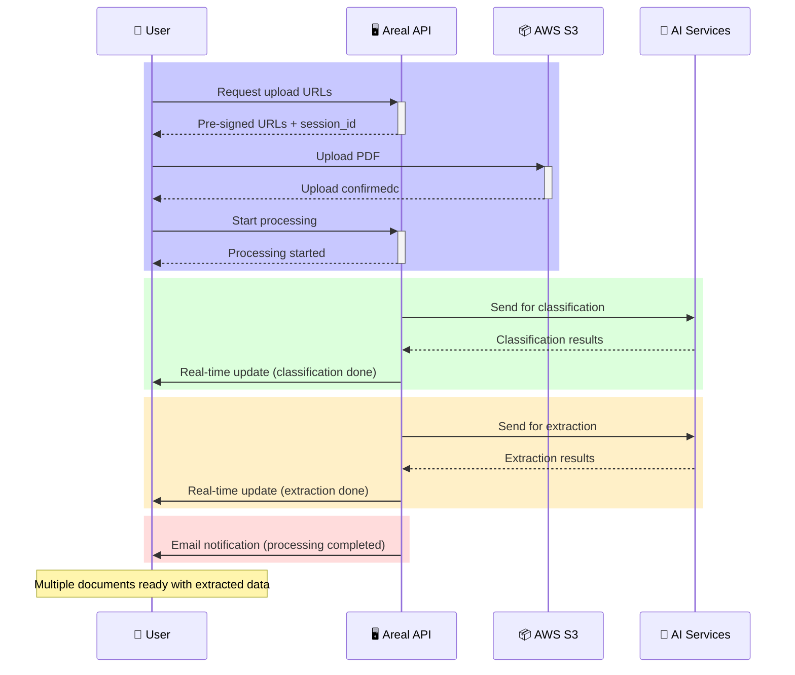

## Document Processing Flow

The document processing functionality is the core of the Areal system, enabling users to upload PDF documents and automatically extract structured data through AI-powered classification and extraction services.

### High-Level Overview

The document processing flow transforms a single uploaded PDF into multiple classified documents with extracted structured data. This process involves several microservices working together to analyze, classify, and extract information from mortgage documents.

### Sequence Diagram

#### Phase 1: Upload Preparation and Initiation
- User requests pre-signed URLs to upload documents.
- User uploads PDF(s) directly to S3 using the provided URLs.
- User tells the system to start processing the uploaded document(s).

#### Phase 2: Classification
- The system analyzes the uploaded PDF(s) and classifies the document types.
- User receives a real-time notification from the API when classification is complete.

#### Phase 3: Extraction
- The system extracts structured data from the classified documents.
- User receives a real-time notification from the API when extraction is complete.

#### Phase 4: Finalization
- User receives an email notification from the API when processing is complete and documents are ready for review.

### Detailed Process Breakdown

#### Phase 1: Upload Preparation & Initiation

##### Pre-signed URL Request

- User requests pre-signed URLs for file upload
- Creates or uses existing UploadSession
- Generates unique document_id for each file
- Returns S3 pre-signed URLs with expiration time

##### File Upload

- User uploads PDF directly to S3 using pre-signed URLs
- Upload handled directly by S3, not through the API

##### Start Processing

- User triggers processing after successful upload
- API validates PDF exists in S3
- Creates initial Document record with "unclassified" template
- Document status: **preparing**

#### Phase 2: Classification

##### Identifies different document types within the PDF

- Detects page templates and boundaries
- May split single PDF into multiple logical documents
- Processes visual elements, text, and layout

#### Phase 3: Data Extraction

##### Extracts structured data from the classified documents

- Extracts structured data based on template components
- Generates confidence scores for extracted values
- Generates parent-child relationships for grouped data

#### Phase 4: Finalization

8. **Document Generation**: Creates final structured documents
    - Links extracted data to appropriate templates
    - Establishes component relationships
    - Sets document status to **completed**
    - Prepares data for frontend consumption

9. **Notifications & Updates**: Completes the processing workflow
    - Sends email notification to user
    - Updates WebSocket clients with completion status
    - Updates loan information if applicable
    - Triggers any configured automation (like Copilot)

### Key Characteristics

- **Asynchronous Processing**: The entire flow is asynchronous with callback-based communication
- **Microservice Architecture**: Classification and extraction are handled by separate services
- **Multiple Documents**: A single PDF can result in multiple classified documents
- **Template-Based**: Each document is associated with a template that defines expected components
- **Real-time Updates**: WebSocket notifications keep the frontend updated throughout the process
- **Error Handling**: Comprehensive error handling with email notifications for failures
- **Scalable**: Services can process multiple documents concurrently

### Status Tracking

Documents progress through these statuses:
- `pending`: Initial state after creation
- `preparing`: PDF uploaded, ready for classification
- `processing`: Classification complete, extraction in progress
- `completed`: Full processing complete, ready for review
- `failed`: Processing encountered an error

### Integration Points

The document processing system integrates with:
- **S3**: For file storage and management
- **Classification Service**: AI-powered document analysis
- **Extraction Service**: OCR and structured data extraction
- **WebSocket Service**: Real-time frontend notifications
- **Email Service**: User notifications
- **Gateway Services**: Integration with external systems (Encompass, RamQuest)
- **Copilot Service**: Automated workflows and AI assistance

