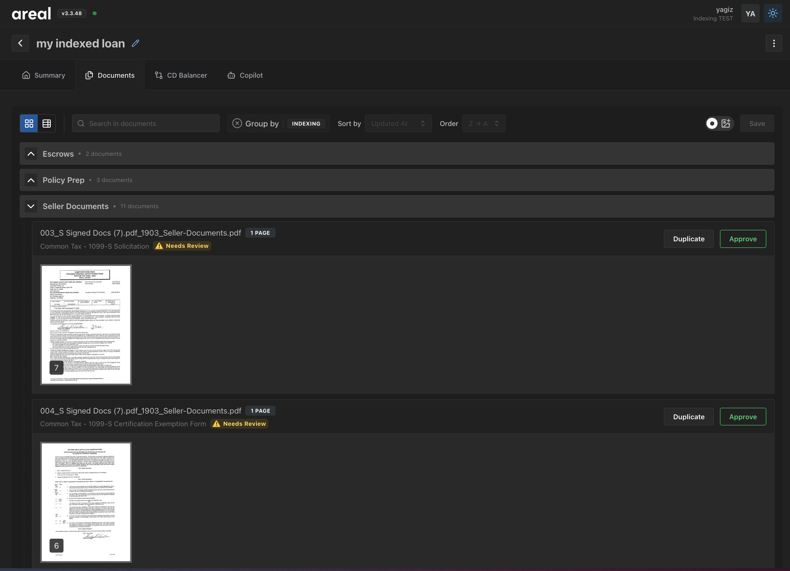

# Indexing API

We support Indexing API for grouping your documents in a custom manner in ArealAI.
If your organization is using this feature, we will group your processed documents into your desired index format.

## Example Views

### Manage View

In ManageView you can move around the final documents within or across the indexes.
You can also duplicate the documents for easier organization.




## Document Duplicatation

When you click on the "Duplicate" button for each document, we will create a new document with the same content.
We will add an indicator to reference the original document.
And you will be able to move this newly created document to a new index

## Downloading Indexed Documents

### Automatic Grouping

We provide an easy to use API to download the indexed documents in a zip file.
When `group_by` is set to `index_id`, we will put the documents in the same index into a folder.

```py title="Automatic Grouping" linenums="1"
import requests  # noqa

SESSION_ID = '66878f5e-c609-4796-9fc2-ecc6ae377cac'

response = client.post(
    f'{BASE_URL}/sessions/{SESSION_ID}/download/', params={'group_by': 'index_id'}
)
with open('documents.zip', 'wb') as f:
    f.write(response.content)

print('✅ Zip file downloaded and saved as documents.zip')
```

### Manual Grouping
You can easily download the indexed documents by filtering the documents by the index you want to download.

```py title="Downloading Indexed Documents" linenums="1"
import requests  # noqa

SESSION_ID = '66878f5e-c609-4796-9fc2-ecc6ae377cac'

# if you don't know your index_ids, fetch them from the session
response = client.get(
    f'{BASE_URL}/sessions/{SESSION_ID}/', 
    params={'group_by': 'index_id'}
)
response.raise_for_status()
index_ids = list(set(o['index_id'] for o in response.json()['objects']))

# use them to filter documents by index_id
index_to_documents: dict[str, list[str]] = {}
for index_id in index_ids:
    response = client.get(
        f'{BASE_URL}/sessions/{SESSION_ID}/', 
        params={'group_by': 'index_id', 'filter_by.index_id': index_id}
    )
    response.raise_for_status()
    document_ids = [o['id'] for o in response.json()['objects']]
    index_to_documents[index_id] = document_ids

# then download them
for index_id, document_ids in index_to_documents.items():
    pdf_urls = []
    for document_id in document_ids:
        response = client.get(f'{BASE_URL}/documents/{document_id}/')
        response.raise_for_status()
        pdf_url = response.json()['pdf_url']
        
        # actual download
        print(f'Downloading {pdf_url}...')
        response = requests.get(pdf_url)
        response.raise_for_status()
        print('File downloaded successfully')    
```
