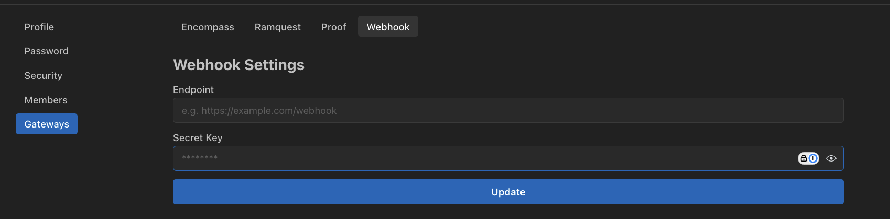

# Webhooks

We support webhooks for event-based notifications.

Your **Organization Administrators** can configure webhooks for the following events:

- Document Processing
- CDBalancer
- Copilot Tasks (coming soon)

We send a POST request to the webhook URL with the following payload:

## Configuration

You can setup webhooks from the **Organization Settings/Gateways/Webhooks** page.



```py title="Webhook Models" linenums="1"

class ProcessingCompletedMessage(BaseModel):
    class Meta(BaseModel):
        upload_session_id: str

    class Data(BaseModel):
        status: Status
        error: Optional[str]

    type: str = 'PROCESSING_COMPLETED'
    meta: Meta
    data: Data

"""
📋 HEADERS:
--------------------------------------------------------------------------------
Host: ab52f05e83fe.ngrok-free.app
User-Agent: python-httpx/0.28.1
Content-Length: 217
Accept: */*
Accept-Encoding: gzip, deflate
Traceparent: 00-0199e776afd66719e9646f175ae2e851-68c0b5e7d0691aca-01
X-Areal-Request-Id: 7d791938-73cd-4a8a-a752-5fc54ee72809
X-Areal-Timestamp: 1760525013
X-Areal-Webhook-Signature: 0e9550e546baff4362f65f21c3f1d924a8c3add70f8737f1db22cb5c8c83e119
X-Forwarded-For: 52.8.69.203
X-Forwarded-Host: ab52f05e83fe.ngrok-free.app
X-Forwarded-Proto: https

📦 BODY:
--------------------------------------------------------------------------------
{
  "data": {
    "error": null,
    "status": "completed"
  },
  "meta": {
    "upload_session_id": "fc2f43a2-2781-46cb-ace2-b84f17dbfe29"
  },
  "request_id": "7d791938-73cd-4a8a-a752-5fc54ee72809",
  "timestamp": 1760525013,
  "type": "PROCESSING_COMPLETED"
}

"""
```