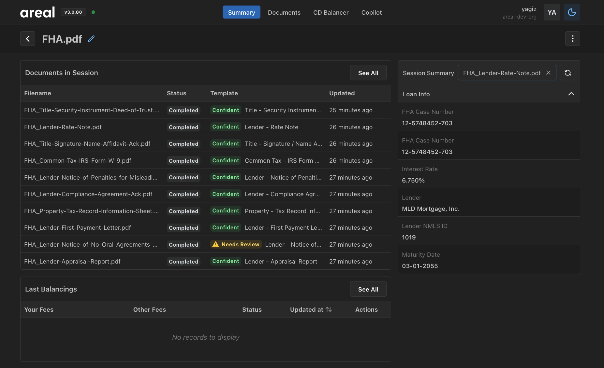
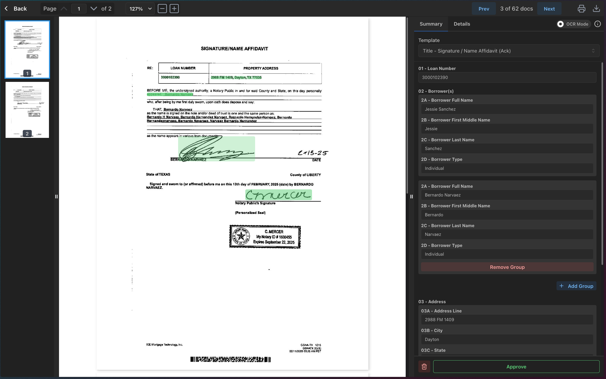

# Upload Sessions

When you upload a document to ArealAI for processing, we create an upload session, a grouping of documents related to your loan.

!!! warning "UploadSession one-to-one with Loan"
    We designed the UploadSession to be one-to-one with a Loan.
    So to get the most accurate results, you should create a new UploadSession for each loan.
    See [Processing](processing/processing.md) for more details.

## Example Views

### List View


### Detail View


## Example Usage

=== "Python"

    ```py title="Get UploadSession details" linenums="1"
    --8<-- "code_samples/sessions/python/get_upload_session_details.py"
    ```

=== "C#"

    ```csharp title="Get UploadSession details" linenums="1"
    --8<-- "code_samples/sessions/c#/get_upload_session_details.cs"
    ```

=== "Java"

    ```java title="Get UploadSession details" linenums="1"
    --8<-- "code_samples/sessions/java/get_upload_session_details.java"
    ```

For technical details see [UploadSession API](https://dev-api.v2.areal.ai/api/v2/docs#/sessions)
