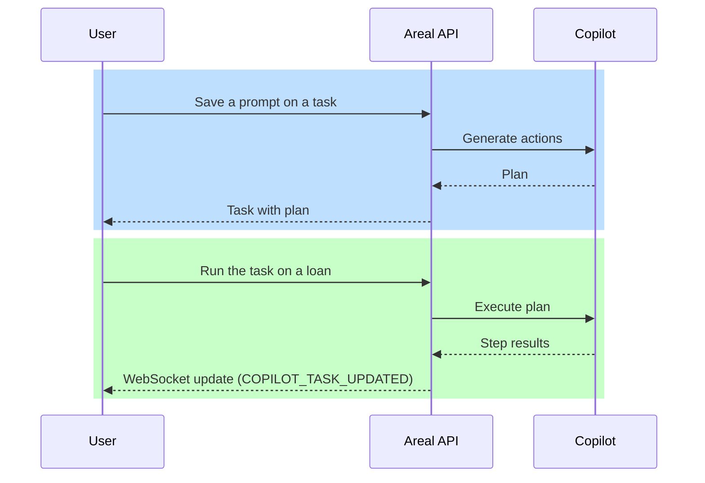

import { Code, TabItem, Tabs } from '@astrojs/starlight/components';
import copilot_python_run_copilot_task from '../../code_samples/copilot/python/run_copilot_task.py?raw';
import copilot_csharp_run_copilot_task from '../../code_samples/copilot/csharp/run_copilot_task.cs?raw';
import copilot_java_run_copilot_task from '../../code_samples/copilot/java/run_copilot_task.java?raw';

Copilot turns a natural-language **prompt** into a step-by-step plan and runs that plan against a [loan](sessions.md). In the dashboard this is **Copilot Agent**. In the API, an agent is a **task group**.

Admins write prompts and generate **actions**. Anyone on the loan can run a task and watch the result.

:::caution[Asynchronous runs]
Running a task or agent returns immediately. Track progress over the WebSocket API, or poll the task until `results.status` is no longer `pending`.

See [Status Tracking](processing/status.md) for the Copilot message types.
:::

## Concepts

- **Agent (task group).** A named set of automations for your organization. The API calls this a task group. It can include a starting condition and a post-run action.
- **Task.** One prompt, the generated plan, and the latest run for the current loan.
- **Run.** One execution of a task against a loan. Status is `pending`, `success`, `failed`, or `n/a`.
- **Generated actions.** The plan Copilot builds from the prompt. The dashboard shows these as numbered steps.
- **Best next action.** Guidance Copilot returns when a run fails.

Each task is scoped to a loan through `session_id`. Create a loan first; see [Loans](sessions.md).

## Dashboard

Open a loan, then **Copilot Agent**.

- **Everyone** sees executions for that loan, can run a task, and can open the result (plan, documents used, best next action).
- **Admins** can switch to admin view to create agents, write prompts, generate actions, and mark tasks active.

## Example Usage

<Tabs>
  <TabItem label="Python">
    <Code code={copilot_python_run_copilot_task} lang="python" title="List agents and run a task" />
  </TabItem>
  <TabItem label="C#">
    <Code code={copilot_csharp_run_copilot_task} lang="csharp" title="List agents and run a task" />
  </TabItem>
  <TabItem label="Java">
    <Code code={copilot_java_run_copilot_task} lang="java" title="List agents and run a task" />
  </TabItem>
</Tabs>

To run every active task in an agent, `POST /api/v2/copilot/task-group/{task_group_id}/execute/` with `{ "session_id": "..." }`.

For the full Copilot API see [Copilot](https://dev-api.v2.areal.ai/api/v2/docs#tag/copilot).
