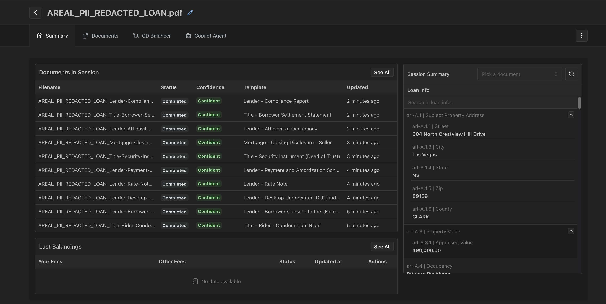
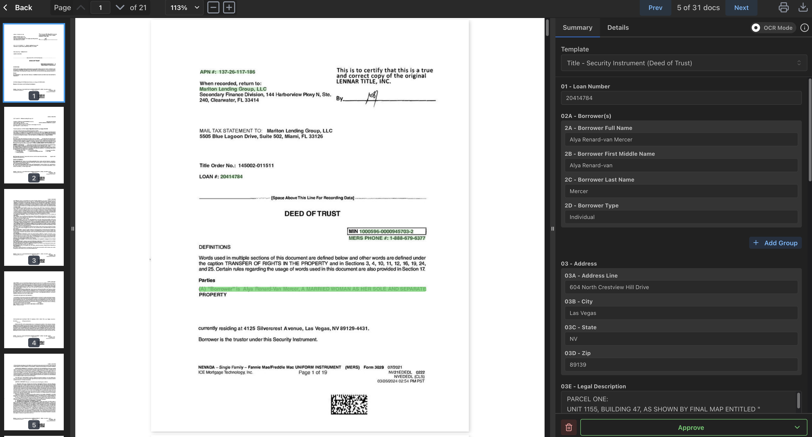

import { Code, TabItem, Tabs } from '@astrojs/starlight/components';
import sessions_python_get_upload_session_details from '../../code_samples/sessions/python/get_upload_session_details.py?raw';
import sessions_csharp_get_upload_session_details from '../../code_samples/sessions/csharp/get_upload_session_details.cs?raw';
import sessions_java_get_upload_session_details from '../../code_samples/sessions/java/get_upload_session_details.java?raw';

When you upload a document to ArealAI for processing, we create an upload session, a grouping of documents related to your loan.

:::caution[UploadSession one-to-one with Loan]
We designed the UploadSession to be one-to-one with a Loan.
So to get the most accurate results, you should create a new UploadSession for each loan.
See [Processing](processing/processing.md) for more details.
:::

## Example Views

### List View

### Detail View

## Example Usage

<Tabs>
  <TabItem label="Python">
    <Code code={sessions_python_get_upload_session_details} lang="python" title="Get UploadSession details" />
  </TabItem>
  <TabItem label="C#">
    <Code code={sessions_csharp_get_upload_session_details} lang="csharp" title="Get UploadSession details" />
  </TabItem>
  <TabItem label="Java">
    <Code code={sessions_java_get_upload_session_details} lang="java" title="Get UploadSession details" />
  </TabItem>
</Tabs>

For technical details see [UploadSession API](https://dev-api.v2.areal.ai/api/v2/docs#/sessions)
